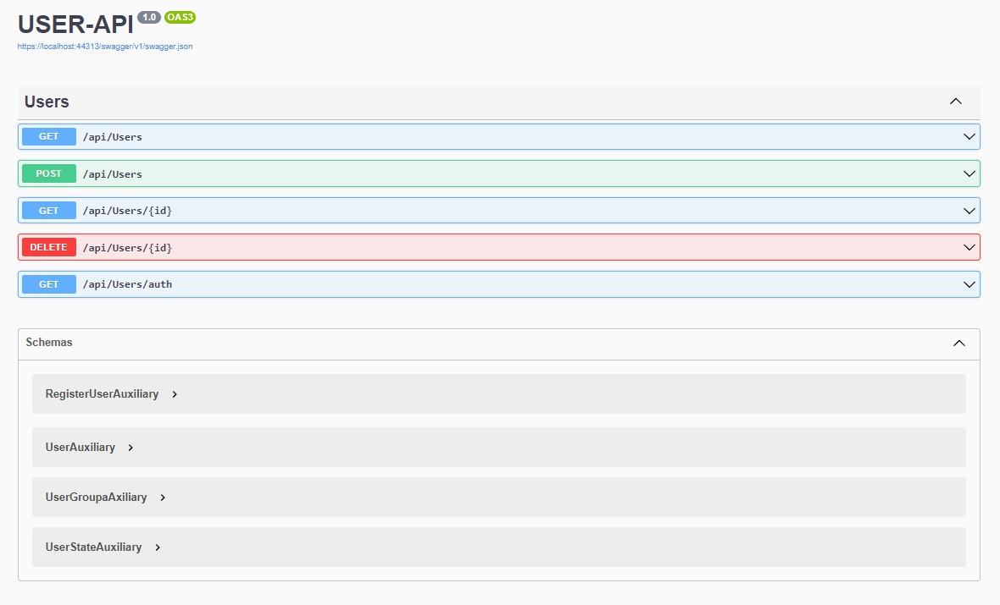
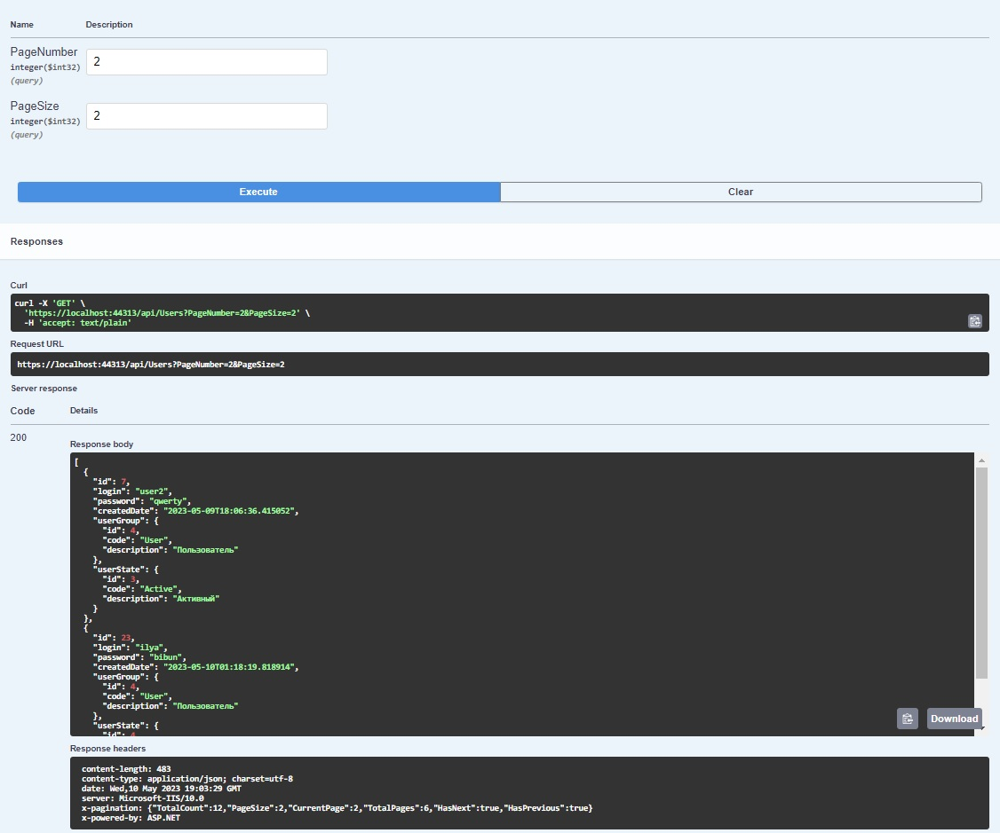
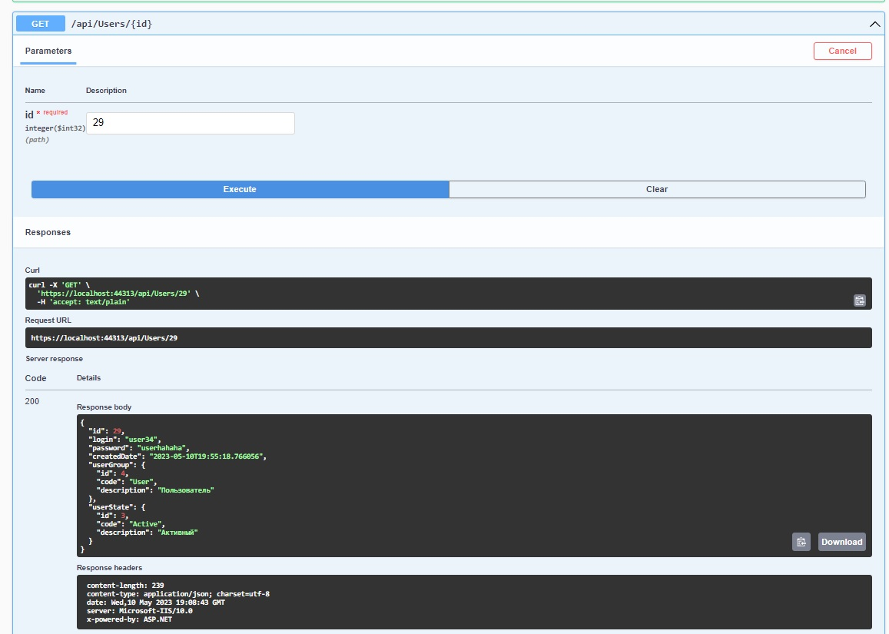
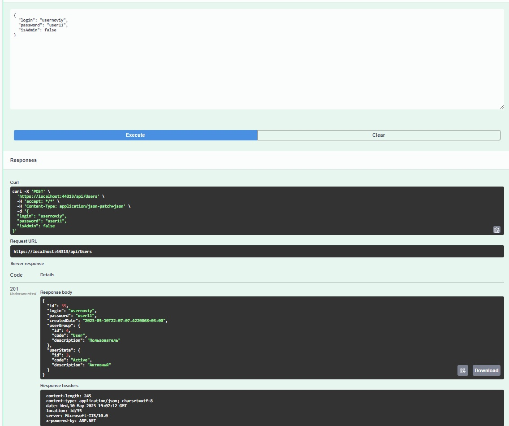
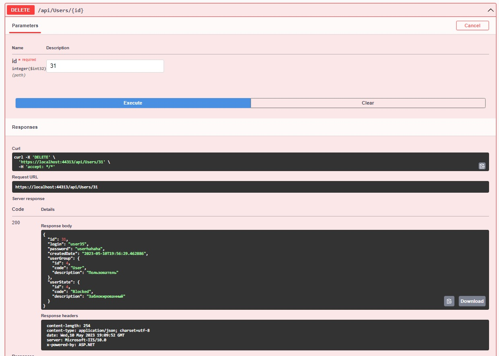
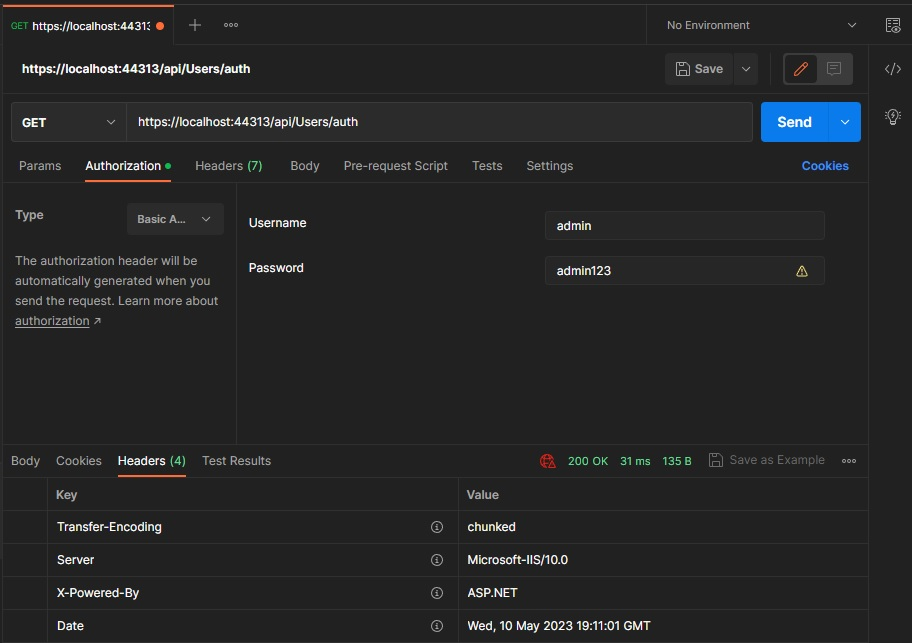

# USER-API

## Database
- Создание базы данных: [db_creation](db_creation.sql),
- Добавление некоторых данных в таблицы: [db_insert](db_insert_some_data.sql),
- Триггер, чтобы не позволять иметь более одного пользователя с user_group.code = “Admin”: [db_check_admin_limit_trigger](db_check_admin_limit_trigger.sql).

## Api Methods
- GetByParams
- GetAsync
- PostAsync
- DeleteAsync
- AuthenticateAsync

## Testing

## GetByParams

## GetAsync

## PostAsync

## DeleteAsync

## AuthenticateAsync
